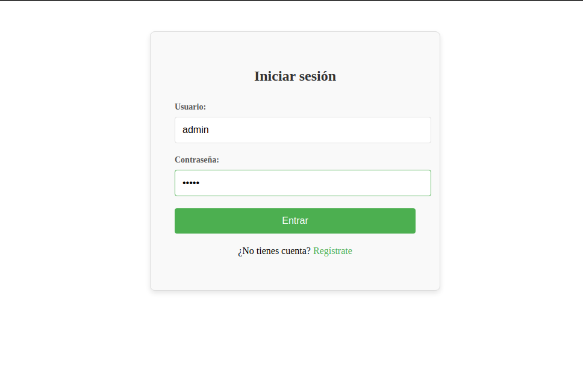
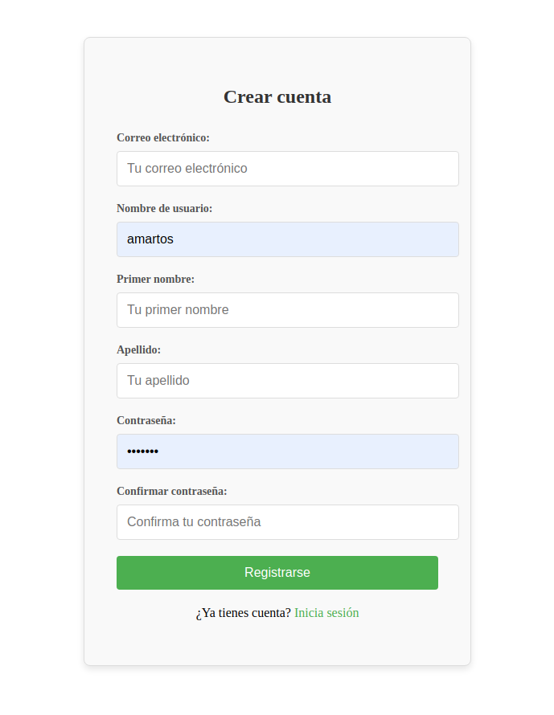
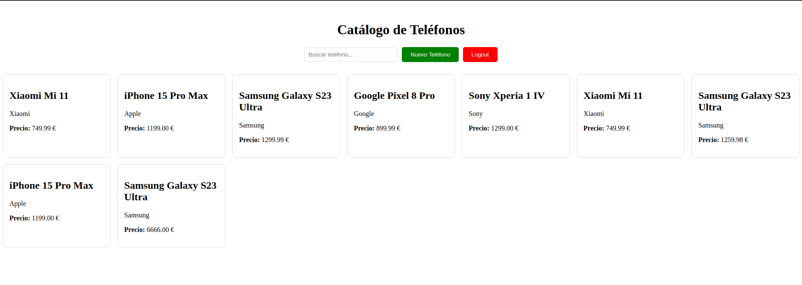
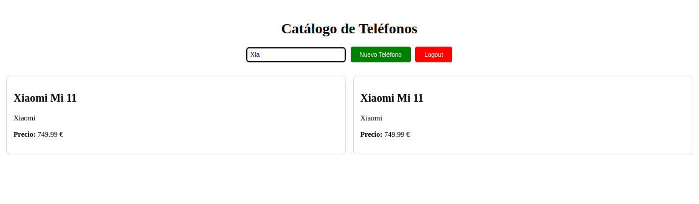
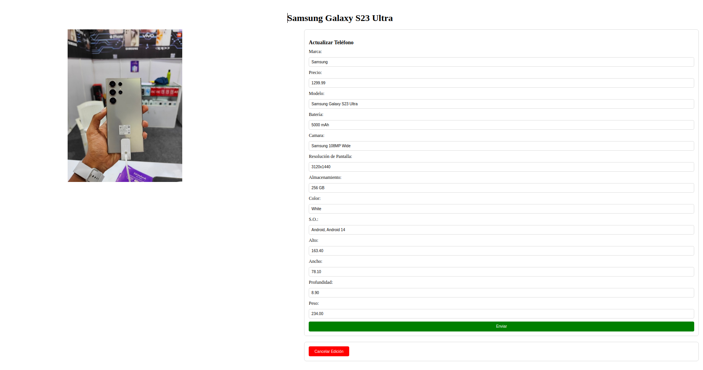

# 📱 MyShop

**MyShop** es un mini proyecto para una prueba técnica. Está compuesto por:

- 📦 Un **Back** en **Django (Python)**
- 💻 Un **Front** en **Vue 3 (JavaScript)**

---

## 📸 Importante sobre las Imágenes

Para las imágenes de los terminales, se usa una API remota de imágenes.  
👉 **Necesitas una Access Key de Unsplash API** para que se puedan ver correctamente.

También se han establecido rutas locales en el frontal para las peticiones al backend, recuerda modificarlas si configuras el backend en otro puerto.

---

## 📦 Requisitos

### 📍 Frontend
- **Vue:** 3.5.13  
- **Node:** v20.19.1  
- **npm:** 10.8.2  

### 📍 Backend
- **PostgreSQL:** v12.22  
- **pip:** 25.0.1  
- **Python:** 3.8.10  

---

## 🚀 Puesta en marcha

### 🎨 Frontend

```bash
npm install
npm run serve
```
### 🎨 Backend

## Puesta en marcha

### 1. Crear un entorno virtual

Para evitar "ensuciar" nuestro sistema operativo con dependencias, utilizaremos un entorno virtual. Primero, asegurémonos de tener `virtualenv` instalado:

```bash
pip install virtualenv
```
Creamos el .venv para almacenar todas las librerias necesarias

```bash
virtualenv -p /usr/bin/python3.8 venv
```

### 2. Instalamos librerias

Una vez comprobamos que tenemos la versión de python y del pip correcta hacemos un pip install del fichero requirements.txt para que se instalen todas las librerias de python que son necesarias

```bash
pip install -r requirements.txt
```
### 3. Aplicamos migraciones

Ahora que tenemos todas las librerias, configuramos la conexión en BBDD y ejecutamos migraciones

```bash
python manage.py makemigrations
python manage.py migrate
```

Una vez tenemos todos los cambios de los modelos aplicados he dejado en la carpeta sql datos mockeados para que no haya que meterlos a mano.

## 🔑 Usuario
He dejado el usuario admin con contraseña admin en la carpeta sql, es el que tiene rol admin y puede ver todas las opciones de edición.
En caso de querer ver el aplicativo desde un punto de vista a nivel usuario, he dejado el usuario amartos con contraseña amartos sin permisos.

## ⚙️ Manual de uso

### 1. Login



### 2. Registro



### 3. Catálogo



### 3.1. Formulario crear un nuevo teléfono


### 3. Busqueda en el catálogo



### 4. Detalles


### 4.1. Formulario de modificación de detalles



